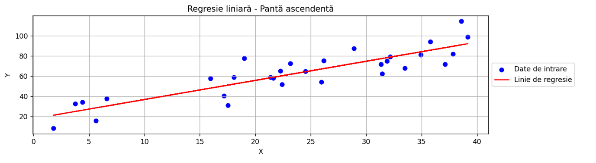
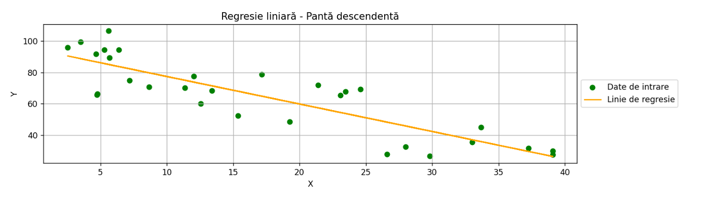

# Project Instructions🧪

## Table of Contents 📑
1. [Instructions](#instructions)
2. [Example Solution](#example-solution)
3. [Data Generation](#data-generation)
4. [Linear Regression](#linear-regression)
5. [Results and Data Pairs](#results-and-data-pairs)
6. [Plots](#plots)

---

## Instructions🎯

- Manually generate several images containing points that show a correlation (at least one image with an ascending slope and at least one with a descending slope).
- In Python, determine the pairs of points (xᵢ, yᵢ) from the images.
- Calculate and display the values of *a*, *b*, and *Q(a,b)* according to the formulas.
- Draw the trend line on the images using a different color.

---

## Example Solution💡

1. **Data Generation**: We use the `np.random.uniform` function to generate 30 random points for each dataset. For the ascending slope, `x_asc` is generated between 1 and 40, and `y_asc` is calculated using the equation of a line with a positive slope. For the descending slope, `x_desc` is generated between 1 and 40, and `y_desc` is calculated using the equation of a line with a negative slope.
   
2. **Linear Regression**: The `linear_regression` function receives the datasets `x` and `y` as arguments and returns the coefficients *a* and *b* of the regression line equation, as well as the predicted *y* values based on these coefficients and the total regression error.

3. **Displaying Results and Data Pairs**: The coefficients *a* and *b*, as well as the total error for each dataset, are displayed. Then, each data pair (xᵢ, yᵢ) for both datasets is shown.

---

## Data Generation📊

### Ascending Slope Data Points:
| Point  | Coordinates             |
|--------|-------------------------|
| 1      | (22.403726653165666, 51.71245585103955) |
| 2      | (28.89238528852436, 87.62528660158847) |
| 3      | (24.50777166679411, 64.5423082833329) |
| 4      | (22.25044413687898, 65.08041597284713) |
| 5      | (17.522537174217284, 30.89061536807055) |
| 6      | (26.18987040959959, 75.17333818761364) |
| 7      | (18.065901239245008, 58.676110000998975) |
| 8      | (35.779147030501115, 94.32032392036629) |
| 9      | (38.58284765954014, 114.63435885223836) |
| 10     | (15.95421923420533, 57.59035192806742) |
| 11     | (31.87727648522392, 74.93240849626821) |
| 12     | (21.626901870363273, 57.92024166169691) |
| 13     | (23.15373788266336, 72.70087958205364) |
| 14     | (37.09826889341378, 71.9066840101447) |
| 15     | (3.770406269717591, 32.545314734490226) |
| 16     | (4.398042688360087, 33.974789509537345) |
| 17     | (1.788517500172703, 8.044250248668247) |
| 18     | (33.47217397636958, 67.74603134720756) |
| 19     | (31.348113287044168, 71.89050236567661) |
| 20     | (34.93047378162595, 81.22793225566991) |
| 21     | (39.1661153470778, 98.99108536296018) |
| 22     | (32.167184004452224, 79.07143611470886) |
| 23     | (18.997695127864343, 77.47221296839386) |
| 24     | (31.440637875171763, 62.47329223400479) |
| 25     | (5.612702608888395, 15.624859242044352) |
| 26     | (25.95691983177343, 54.17276796837169) |
| 27     | (6.59077820895281, 37.57143106384855) |
| 28     | (37.84208776493377, 82.08229764415773) |
| 29     | (21.352084548252794, 58.688153875039376) |
| 30     | (17.17181565963042, 40.34278295933296) |

### Descending Slope Data Points:
| Point  | Coordinates             |
|--------|-------------------------|
| 1      | (7.199813762175269, 74.93597533595903) |
| 2      | (5.3046305054079, 94.42420608754988) |
| 3      | (26.596853989145664, 27.73719582990632) |
| 4      | (6.389135102595938, 94.45645398014358) |
| 5      | (8.666712105522087, 70.68984997157987) |
| 6      | (15.3802816557776, 52.48304797876506) |
| 7      | (33.01873596406947, 35.3556101383148) |
| 8      | (4.78694975592939, 66.33094006657842) |
| 9      | (33.67985139245335, 44.94259852987464) |
| 10     | (4.747837907864559, 65.71562061293551) |
| 11     | (39.08191913552243, 27.33790588478549) |
| 12     | (19.27739686426036, 48.5955650651267) |
| 13     | (39.09368243942315, 29.89636611667047) |
| 14     | (24.588975270056793, 69.12053399017114) |
| 15     | (29.831279596533765, 26.531332265330583) |
| 16     | (2.528323897918506, 95.87043225296566) |
| 17     | (12.029471540479975, 77.58294382627281) |
| 18     | (5.687665887313587, 89.37600398596213) |
| 19     | (12.549467703363652, 59.93973806210052) |
| 20     | (5.630381039215518, 106.61294343983329) |
| 21     | (13.401343996365064, 68.3179540450631) |
| 22     | (17.156256786072127, 78.7758766890565) |
| 23     | (3.50175235760259, 99.47306267408251) |
| 24     | (28.006412655430776, 32.371837477619465) |
| 25     | (23.09745671405643, 65.42598845849861) |
| 26     | (11.350190146638372, 70.14237804483756) |
| 27     | (21.40667408520129, 71.8362956995997) |
| 28     | (4.663679919579225, 91.8299194294552) |
| 29     | (23.46191332669099, 67.7542646300864) |
| 30     | (37.24255170547235, 31.67881814255476) |

---

## Linear Regression📐

- **Ascending Slope**:
  - Coefficient *a*: 17.6293
  - Coefficient *b*: 1.9027
  - Total Error: 3837.8738

- **Descending Slope**:
  - Coefficient *a*: 94.8914
  - Coefficient *b*: -1.7545
  - Total Error: 4421.7837

---

## Results and Data Pairs📝

- **Displaying the coefficients a and b** for both ascending and descending datasets along with the total errors.
- **Point pairs for both datasets** are provided above.

---

## Plots📊

- **Visualization** of both the data points and the trend lines is presented in the form of plots. The trend lines will be clearly visible in contrasting colors to indicate the direction of the relationship between the points.

  
   
  <em>Linear Regression: Ascending Slope</em>
   
   
  
   
  <em>Linear Regression: Descending Slope</em>

